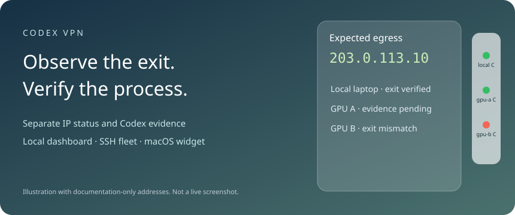

# Codex VPN

**See which public IP your machines use — and distinguish it from evidence about Codex's own connections.**

Read-only multi-machine proxy monitoring, a local browser dashboard, a translucent macOS floating widget, and an optional self-hosted HTTPS IP checker.

[中文教程](README_CN.md) · [Online deployment](docs/ONLINE.md) · [Security model](SECURITY.md) · [Verification guide](docs/VERIFICATION.md)

> This project does **not** provide a VPN service, subscriptions, proxy nodes, TUN configuration, or a kill switch. Bring your own working Clash/Mihomo installation. An HTTP IP check is **not** proof that every Codex model request uses that IP.



## Contents

1. [What it shows](#what-it-shows)
2. [Requirements](#requirements)
3. [Quick start](#quick-start)
4. [macOS floating widget](#macos-floating-widget)
5. [Multiple machines](#multiple-machines)
6. [Reproducible five-device profile](#reproducible-five-device-profile)
7. [Verify a Codex task](#verify-a-codex-task)
8. [Online IP checker](#online-ip-checker)
9. [Configuration and storage](#configuration-and-storage)
10. [Development and verification](#development-and-verification)
11. [Troubleshooting](#troubleshooting)

## What it shows

- Independent Cloudflare and ipify IPv4 probes through each machine's explicit local proxy.
- Selected native proxy-group node, expected IP, proxy port, controller port and sample age.
- A separate Codex evidence result: environment configured, core process metadata, or socket-to-PID correlation.
- A macOS floating panel that collapses into a **white translucent vertical strip**, one device dot per row, with a separate colored `C` marker.
- Adjustable opacity, text scale, position and window size; menu-bar show/hide/always-on-top controls; login startup.
- SSH-based collection from user-configured aliases; no hardcoded machines, subscription addresses or infrastructure.
- A private local dashboard at `http://127.0.0.1:8766` and an optional independent Cloudflare Worker online checker.

The main dot means **exit verification**: green = fresh matching probes and node; red = failed check/mismatch; amber = missing/expired evidence. The small `C` means **Codex connection evidence**. A green dot with amber `C` is normal when there is no attributable active model connection. Green never promises future leak prevention.

Version 0.1 focuses on observability. It does **not** ship subscription import, coordinated node switching, automatic failover, or the original deployment's private hosting integration. Existing native node health history is not presented as fresh measurements; candidate latency is left unavailable. Displayed latency is a single real HTTPS request duration, not ICMP ping, model first-token time, or a smoothed statistic.

## Requirements

- Python **3.9+** and `curl` on each monitored machine; Python runtime uses only the standard library.
- Existing Clash/Mihomo-compatible HTTP proxy and loopback controller. Know their ports, controller secret and a **manual selector group** name.
- macOS widget: **macOS 14+**, Xcode Command Line Tools (`xcrun swiftc --version`), a logged-in desktop session, `/usr/bin/python3`.
- Linux Codex evidence: `/proc` and `ss` from `iproute2`; Mac evidence: `ps` and `lsof`.
- Remote collection: SSH key/agent access to an existing SSH alias. Host-key verification is never disabled.
- Online checker only: Node **22+**, Cloudflare account with Workers + D1, and Wrangler.

Windows is not a supported evidence platform in this release. Linux browser/CLI work does not imply native Linux widget support.

## Quick start

Clone and keep the checkout:

```bash
mkdir -p ~/Code
cd ~/Code
git clone https://github.com/asimfish/codex-vpn.git
cd codex-vpn
python3 -m codex_vpn init
```

Expected: `Created private config: .../.config/codex-vpn/config.json`. Existing configuration is never overwritten.

Edit that file. Replace **all** placeholder values with your own:

```json
{
  "node": "My US node",
  "expected_ip": "203.0.113.10",
  "nodes": ["My US node"],
  "devices": [
    {
      "id": "local",
      "name": "My Mac",
      "proxy_port": 7890,
      "controller_port": 9090,
      "selector_group": "PROXY",
      "controller_secret_file": "~/.config/codex-vpn/controller.secret"
    }
  ]
}
```

`203.0.113.10` is a documentation address, **not a usable node**. Replace it with your expected public exit. Node and group names must match the controller exactly. `127.0.0.1` always means the machine doing the sampling.

Create `~/.config/codex-vpn/controller.secret` in a local editor, put only your controller secret inside, then protect it:

```bash
chmod 600 ~/.config/codex-vpn/config.json
chmod 600 ~/.config/codex-vpn/controller.secret
python3 -m codex_vpn sample --device local
```

If your controller has no secret, omit `controller_secret_file`; an unset `CODEX_VPN_CONTROLLER_SECRET` sends an empty bearer value. A secret file is recommended for login startup because LaunchAgents do not inherit shell exports.

Expected sample: `status: "ok"`, both `ip` and `secondary` equal your target, and `node` equals your chosen node. A `sample` command prints diagnostics even when checks fail; inspect `status` rather than relying on its process exit code.

Run the dashboard:

```bash
python3 -m codex_vpn serve
```

Open `http://127.0.0.1:8766`. The collector samples about every 30 seconds, the browser refreshes every 5 seconds, and evidence expires after 100 seconds. Use `--port 8877` if the default port is occupied. Stop with Ctrl-C.

No `pip install` is needed when running these commands **from the checkout**. Optional CLI installation in an isolated environment:

```bash
python3 -m venv .venv
.venv/bin/python -m pip install --no-deps .
.venv/bin/codex-vpn --help
```

Build isolation may download setuptools; there are no third-party runtime packages.

## macOS floating widget

After the local `sample` command works:

```bash
xcrun swiftc --version
python3 scripts/install_macos.py
```

If the compiler is missing, run `xcode-select --install`, finish Apple's dialog, then retry. Do not run the installer with `sudo`.

Expected: `APP_INSTALLED .../Applications/CodexVPN.app`. Look for **◉ IP** in the menu bar. The application is locally compiled and ad-hoc signed, not notarized. No prebuilt binary is required.

- Collapse arrow: switch to a narrow vertical strip; click any dot or the bottom arrow to expand.
- Drag the title/empty background to move; drag edges to resize.
- Settings: opacity and text scale. Preferences and full-window geometry are remembered.
- Menu bar: show, hide, compact/full, always-on-top, quit.
- The app collects independently of the browser. The “full dashboard” button requires `serve` to be running on its default port.
- Startup means **after login**, not before login or while the Mac sleeps. Quit is respected until the next login/manual launch.
- Run either the widget or dashboard collector when possible; both running means duplicate probes.

Upgrade after saving your own source edits:

```bash
git pull --ff-only
# Quit Codex VPN from its menu before replacing the running binary.
python3 scripts/install_macos.py
```

Uninstall the app/login item, preserving private configuration and samples:

```bash
python3 scripts/uninstall_macos.py
```

For a build-only check that does not install a login item or start the app:

```bash
python3 scripts/install_macos.py --dest .build/CodexVPN.app --no-autostart --no-start
```

## Multiple machines

On **each remote Linux/Mac machine**:

1. Clone this repository and run `python3 -m codex_vpn init` from the checkout.
2. Set its device ID, ports, selector, target IP and node in its own private config. Put its controller secret in a local secret file.
3. Check `python3 -m codex_vpn sample --device gpu-a` locally on that machine.
4. Install the self-contained remote runner:

```bash
python3 -m codex_vpn agent-install
python3 ~/.local/share/codex-vpn/agent.py sample --device gpu-a
```

This copies Python source only. It does not install a daemon or change proxy settings. Re-run `agent-install` after upgrades.

On the **monitoring Mac/hub**, add a device to its `devices` array:

```json
{
  "id": "gpu-a",
  "name": "GPU workstation",
  "ssh": "gpu-a",
  "remote_home": "/home/alice",
  "proxy_port": 7890,
  "controller_port": 9090,
  "selector_group": "PROXY"
}
```

`ssh gpu-a` must already work without interactive prompts. The runner path is derived from `remote_home`; its configuration stays in that remote user's `~/.config/codex-vpn/config.json`. Do **not** copy controller secrets into the hub registry. Set target IP/node consistently on all machines. The hub rechecks returned exit data against its own expected target.

```bash
ssh -o BatchMode=yes gpu-a 'python3 ~/.local/share/codex-vpn/agent.py sample --device gpu-a'
python3 -m codex_vpn collect
```

`collect` prints a snapshot and updates the widget's local cache. SSH failure produces an unavailable row, never fabricated green data. New devices are picked up on the next collection cycle. There is no arbitrary remote-command field or automatic SSH configuration editing.

## Reproducible five-device profile

For a reproducible five-device topology (30109, mainskill, 5090, 4090 and a Mac) with the proxy/control port matrix and five-node selector shape, see [`examples/five-device-lab/README_CN.md`](examples/five-device-lab/README_CN.md). The profile is sanitized: fill in your own SSH aliases, expected egress IP and controller secrets locally.

## Verify a Codex task

Run on the **machine actually hosting that Codex process**:

```bash
pgrep -x codex
ps -o pid,ppid,tty,comm -p 12345
python3 -m codex_vpn watch --device local --seconds 120 --pid 12345
```

Replace `local` and `12345`. During the observation interval, send a real request in that task. `watch` itself does not call a model. It first verifies the proxy exit, then checks active connections roughly every 2 seconds.

- `CODEX_PATH_OBSERVED` / exit 0: observed related traffic; check the PID, host, `source: socket-pid`, and target node in `chains`.
- `CODEX_UNVERIFIED` / exit 3: insufficient evidence, including idle processes or missed short connections.
- `CODEX_PATH_MISMATCH` / exit 2: an observed related connection did not include the target node. Network preflight failure also exits 2 with diagnostics.

Without `--pid`, a different Codex task's connection can be observed. Even a correct PID can make non-model requests to the same service domain. Read [the precise limitations](docs/VERIFICATION.md).

## Online IP checker

Deploy **your own** small Worker + D1 service using [docs/ONLINE.md](docs/ONLINE.md). No hosted service, deployment identity or credentials are included in this repository.

Add to your private config:

```json
"online": {
  "url": "https://YOUR-WORKER.workers.dev/check",
  "token_env": "CODEX_VPN_CHECK_TOKEN"
}
```

Set the device's token securely in its environment, then:

```bash
python3 -m codex_vpn online-check --device local
python3 -m codex_vpn online-check --device local --explicit-proxy
```

Default uses the current Python process's proxy environment; explicit mode uses the configured local HTTP proxy. A default failure followed by explicit success is **not** a default-path pass. The online test checks this HTTP client, not Codex's model transport. Keep tokens out of prompts and screenshots.

## Configuration and storage

- `~/.config/codex-vpn/config.json`: private local configuration, created mode 600.
- `~/.config/codex-vpn/controller.secret`: optional user-created secret file, mode 600.
- `~/.local/share/codex-vpn/widget-snapshot.json`: sanitized latest sample, mode 600; no subscription/controller secrets.
- `~/.local/share/codex-vpn/agent.py` and `codex_vpn/`: installed remote runner.
- `~/Applications/CodexVPN.app`: optional native app, bundled Python collector.
- `~/Library/LaunchAgents/com.asimfish.codex-vpn.plist`: optional login item.

Use `--config /absolute/path/config.json` for CLI commands. The native widget uses the default path. Configuration is reread between collection cycles. Only the current user owns the local dashboard; it binds loopback and rejects unrelated Host headers. Do not expose it using a reverse proxy or port-forward as if it were authenticated.

## Development and verification

```bash
python3 -m unittest discover -s tests -v
node --test tests/worker.test.mjs
xcrun swiftc Sources/main.swift -o /tmp/CodexVPN -framework AppKit -framework SwiftUI
/tmp/CodexVPN --self-test
```

Local release checks: Python unit tests, Worker handler tests, native compilation and native status assertions on Apple Silicon macOS. Live own-host proxy sampling and sanitized publication checks are recorded in [docs/RELEASE_CHECKS.md](docs/RELEASE_CHECKS.md). A mocked controller test is not a real network or leak test. GitHub Actions runs Python tests and macOS compilation; inspect its actual run status before assuming CI passed. Intel macOS and Windows have not been verified.

## Troubleshooting

- **All amber at startup:** finish config/secret setup and run `sample`; first remote collection can take up to about a minute.
- **Exit green, C amber:** no sufficiently attributable active Codex connection. It is not a latency alarm.
- **SSH works in a terminal but not the widget:** BatchMode needs an available key/agent; GUI startup may not inherit your shell's agent or environment. Fix your existing SSH setup, not host-key checks.
- **Controller failure:** check the controller port, exact group name and secret. Proxy port and controller port are different.
- **Node matches but IP differs:** node names are not fixed-IP guarantees. Keep the mismatch visible and investigate the provider.
- **High latency:** the displayed number includes an actual HTTPS request; cold handshakes and congestion can cause spikes. No automatic switching occurs.
- **TUN off:** correctly configured clients can still use the proxy. Other clients may go direct.
- **TUN on:** capture depends on routes, rules, UID and exclusions. It does not guarantee a kill switch.
- **IPv6:** the two local probes force IPv4. They do not prove absence of IPv6 bypass.
- **No candidate-node delay:** this release does not actively measure alternative nodes or create probe listeners.
- **Online 401:** wrong/missing device or admin token. History requires the separate admin token.

## Credits and license

The floating-widget presentation and README organization were inspired by [asimfish/codex_monitor](https://github.com/asimfish/codex_monitor). This is a separate proxy-observability project, not a Codex quota/account manager, and is not affiliated with OpenAI or Clash/Mihomo.

MIT — see [LICENSE](LICENSE).
